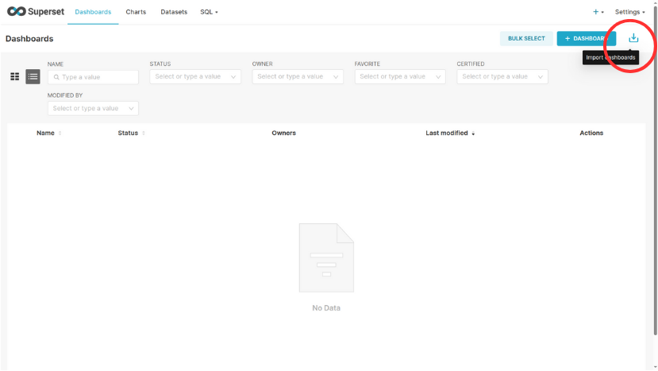
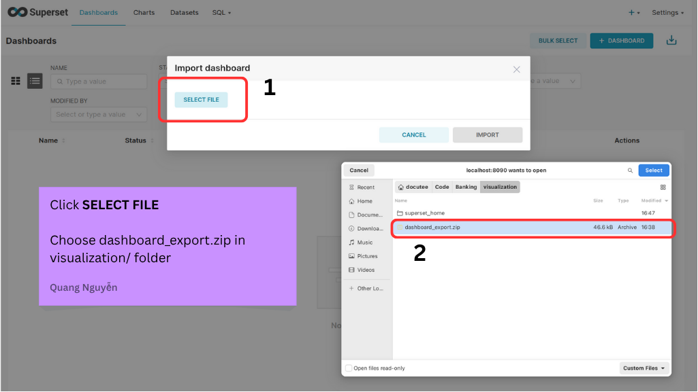

# Banking Data Quality & Audit Platform


## Table of Contents
- [My Story](#my-story)
- [Architecture](#architecture)
- [Project Directory](#project-directory)
- [Prerequisites](#prerequisites)
- [Installation](#installation)
- [Accessing the Airflow Pipeline](#accessing-the-airflow-pipeline)
- [Visualizing Data with Superset](#visualizing-data-with-superset)
- [Schema](#schema)
- [Data Generation](#data-generation)
- [Data Quality Check](#data-quality-check)
- [Audit](#audit)
- [Visualization](#visualization)
- [Contact](#contact)

## My Story

This is my first time working with a banking system. Initially, I struggled to explore domain knowledge, understand core use cases in banking, and follow the 2345/QĐ-NHNN 2023 regulation. I tried signing up for a TIMO BANK account to learn about the transaction process in the TIMO bank app, but I encountered issues because my information in the TIMO database did not match my CCCD card. So, I used MBBank to learn how a bank app works. Fun fact: I even called a bank support representative to ask more about this domain. Once I understood the domain, I was able to design and implement a simplified banking system more easily. I really hope this project will help me advance to the next round of the internship. I have tried to break down the code into modules for easier understanding. If you need clarification on any part of this project, I am ready to answer any of your questions.


## Architecture 


The system is containerized using Docker Compose and consists of several main components:

- **Airflow**: Orchestrates data generation and quality checking workflows.
- **Python Service**: Handles data generation and auditing logic using SQLAlchemy and Faker.
- **PostgreSQL**: Stores all banking data, including customers, accounts, transactions,...
- **Superset**: Provides interactive dashboards for data visualization and monitoring.


## Project Directory

```
.
├── airflow                  # Airflow configuration, DAGs, and logs
│   ├── airflow.Dockerfile   # Dockerfile for setting up Airflow environment
│   ├── config               # Contains airflow.cfg configuration
│   │   └── airflow.cfg
│   ├── dags                 # Data pipelines (DAG definitions)
│   │   └── banking_dq_dag.py
│   └── logs                 # Airflow log files for task/job execution
├── material/                # Project-related images, diagrams
├── source_py                # Core Python source code and data logic
│   ├── python.Dockerfile    # Dockerfile for Python services
│   └── src
│       ├── audit_data/         # SQL scripts for auditing data
│       ├── check_data/         # Python scripts for data validation checks
│       ├── generate_data/      # Python scripts to simulate/mock data
│       ├── model/              # Data models and ORM definitions
│       ├── generate_data.py    # Main script to generate mock data
│       ├── data_quality_standards.py  # Standards for data quality checks
│       └── requirements.txt    # Python dependencies
├── sql
│   └── schema.sql          # Database schema definitions
├── visualization
│   ├── dashboard_export.zip    # Exported dashboards (e.g., Superset)
│   └── superset.Dockerfile     # Dockerfile for Superset visualization tool
├── docker-compose.yml      # Compose file to orchestrate services (Airflow, PostgreSQL, Superset, etc.)
├── Readme.md               # Project overview and documentation


```


## Prerequisites
Ensure you have Docker installed on your system before proceeding.

## Installation

1. Clone the repository from GitHub and navigate to the project folder:
```bash
git clone https://github.com/DOCUTEE/TIMO_bank.git
cd TIMO_bank
```

2. Start all services using Docker Compose:
```bash
docker compose up --build
```

## Accessing the Airflow Pipeline

A pre-configured pipeline is available in Airflow to automate data generation and quality checks. Follow these steps:

1. Access Airflow at [http://localhost:8081/](http://localhost:8081/).
2. Log in with the credentials:
   - **Username**: `admin`
   - **Password**: `admin`

   

3. Locate the pipeline designed for data generation and quality checks. Click on it to view details.

   

4. The pipeline is scheduled to run daily. To trigger it manually, click the "Run" button.

   

## Visualizing Data with Superset

To view risk alerts through a visualization dashboard, use the Superset service:

1. Access Superset at [http://localhost:8090/](http://localhost:8090/) and log in with:
   - **Username**: `admin`
   - **Password**: `admin`

   

2. If this is your first time accessing Superset, you need to import the dashboard manually:
   - Navigate to the **Dashboards** tab and click the **Import** button.

     

   - Follow the prompts to import the dashboard using the provided zip file.

     

3. Once imported, you can view the pre-built dashboard.

   

4. Explore the complete dashboard for a comprehensive overview.

   
## Schema


Below is a short and simple description of the tables in the provided database schema:

- **customer**: Stores customer information, including `full_name` (full name), `date_of_birth` (date of birth), `email`, `customer_pwd` (password), `phone_number` (phone number), `created_at` (creation time), and `customer_id` (customer ID).

- **device**: Contains device information, with fields like `device_type` (device type), `os` (operating system), `is_verified` (verified status), `first_seen` (first seen), `last_seen` (last seen), `app_version` (app version), and `device_id` (device ID).

- **account**: Manages bank account details, including `customer_id` (customer ID), `account_number` (account number), `account_type` (account type), `balance` (balance), `acc_status` (account status), `date_opened` (opening date), `date_closed` (closing date), and `account_id` (account ID).

- **customer_device**: Links customers to devices, with `customer_id` and `device_id`.

- **customer_identity**: Stores customer identification details, including `customer_id`, `identity_type` (identity type), and `identity_number` (identity number).

- **customer_risk**: Tracks risks related to customers, with `customer_id`, `detected_time` (detection time), `details` (details), and `risk_id` (risk ID).

- **device_risk**: Tracks risks related to devices, with `device_id`, `detected_time`, `details`, and `risk_id`.

- **transaction_log**: Records transactions, including `account_id` (account ID), `device_id`, `amount` (amount), `transaction_type` (transaction type), `transaction_time` (transaction time), `description` (description), `status` (status), and `transaction_id` (transaction ID).

- **authentication**: Stores authentication methods, with `auth_method` (method) and `is_strong` (is strong).

- **authentication_log**: Logs authentication events, including `customer_id`, `device_id`, `auth_method`, `auth_time` (authentication time), `status`, `used_for` (purpose), and `auth_log_id` (log ID).

- **auth_transaction**: Links transactions to authentication, with `transaction_id` and `auth_log_id`.

- **transaction_risk**: Tracks risks related to transactions, with `transaction_id`, `detected_time`, `details`, and `risk_id`.

### Relationships
- `customer` is linked to `account`, `customer_device`, `customer_identity`, `customer_risk`, and `authentication_log`.
- `device` is linked to `customer_device`, `device_risk`, `transaction_log`, and `authentication_log`.
- `account` is linked to `transaction_log`.
- `transaction_log` is linked to `auth_transaction` and `transaction_risk`.
- `authentication` is linked to `authentication_log`.
- `authentication_log` is linked to `auth_transaction`.

This schema supports the management of customers, devices, accounts, transactions, and related risks.

## Data Generation


The platform generates synthetic data to simulate key banking scenarios, including:

- **Authentication methods**: Different ways customers can log in, like using passwords or faces.
- **Customers**: Making fake customer profiles with simple details.
- **New devices**: Old customers buying and using new phones for banking.
- **Device verification**: Checking if a device really belongs to the customer.
- **Transactions**: Making fake income and expense transactions.

This data is used to test and validate the platform’s data quality and auditing features.

## Data Quality Check


Data quality is enforced via scripts in [`source_py/src/check_data/`](source_py/src/check_data/):

- **Null Checks**: Ensures critical columns are not null.
- **Uniqueness**: Verifies primary key and identity uniqueness.
- **Format Checks**: Validates national ID formats.
- **Foreign Key Checks**: Ensures referential integrity across tables.


## Audit


Audit SQL queries in [`source_py/src/audit_data/`](source_py/src/audit_data/) help monitor security and compliance:

- **Unverified Devices**: Detects devices not yet verified.
- **Risky Authentications**: Finds devices without proper authentication.
- **Transactions Over 10M VND Without Strong Authentication**: Identifies transactions exceeding 10 million VND that were not authenticated using strong methods.
- **Large Transactions Without Strong Auth**: Flags expenses over 20M VND without biometric authentication.

## Visualization

Superset is used for interactive dashboards and analytics:

- **Dockerized Superset**: See [`visualization/superset.Dockerfile`](visualization/superset.Dockerfile).
- **Dashboard Exports**: Example dashboards in [`visualization/dashboard_export.zip`](visualization/dashboard_export.zip).

## Contact 

If you have any questions or need further assistance, feel free to reach out:

- **Email**: quangforwork1203@gmail.com
- **GitHub**: [DOCUTEE](https://github.com/DOCUTEE)
- **SMS/ZALO**: 0935601729

I'm happy to help with any inquiries about the project!
